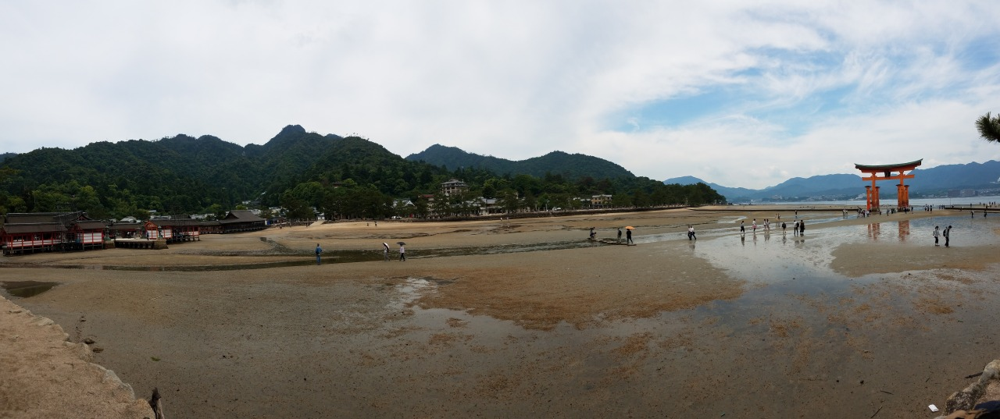

<!-- omit from toc -->
# UA Study Abroad in Japan 2017
In 2017, I was able to participate in a two week study abroad program in Japan with the University of Akron. As part of the program, we were expected to keep a blog with certain information on Tumblr. Because I don't really use that Tumblr account anymore, I decided to copy everything over here before deleting the account so that I could maintain it for my records.

***I will put the disclaimer that a lot of this is just answering questions for homework or rushed out since I was more focused on enjoying my time in Japan. As such, this isn't exactly my best writing.***

<!-- https://www.tumblr.com/blog/fenriskiba-blog -->

**Table of Contents:**
- [March 5, 2017: Homework 1](#march-5-2017-homework-1)
- [April 8, 2017: Blog Post 3](#april-8-2017-blog-post-3)
- [April, 8, 2017: Blog Post 4](#april-8-2017-blog-post-4)
- [April 15, 2017: Blog Post 5](#april-15-2017-blog-post-5)
- [April 16, 2017: Blog Post 6](#april-16-2017-blog-post-6)
- [April 16, 2017: Blog Post 7](#april-16-2017-blog-post-7)
- [April 19, 2017: Blog Post 8](#april-19-2017-blog-post-8)
- [May 24, 2027: Blog #1 - Hiroshima](#may-24-2027-blog-1---hiroshima)
- [May 26, 2017: Blog 2 - Miyajima](#may-26-2017-blog-2---miyajima)
- [May 26, 2017: 五百円](#may-26-2017-五百円)
- [May 26, 2017: Blog 3 - Kyoto Sky Bus](#may-26-2017-blog-3---kyoto-sky-bus)
- [May 28, 2017: Blog 4](#may-28-2017-blog-4)
- [May 28, 2017: Blog 5](#may-28-2017-blog-5)
- [May 31, 2017: Blog Post 6](#may-31-2017-blog-post-6)
- [May 31, 2017: Blog Post 7](#may-31-2017-blog-post-7)
- [June 9, 2017: Blog Post 8](#june-9-2017-blog-post-8)
- [June 9, 2017: Blog Post 9](#june-9-2017-blog-post-9)
- [June 9, 2017: Blog Post 10](#june-9-2017-blog-post-10)
- [June 9, 2017: Blog Post 11](#june-9-2017-blog-post-11)
- [June 9, 2017: Blog Post 12](#june-9-2017-blog-post-12)

## March 5, 2017: Homework 1
"This writing system causes the Japanese to think in a different way from us." (p.13)  
I hadn't really considered this very well before. In my struggles with kanji in the past, I've always considered it a convoluted system (and still do), but it seems much more reasonable given more context. Kanji has had a strong influence on Japan, and, as such, the way the Japanese people deal with Kanji is much more fluid that it would be to someone trying to learn it new.

"This whole philosophy [Bushido] has reached the West through the martial arts." (p.15)  
I hadn't really considered Bushido to have spread into as much of modern culture as it has. I often consider it similar to Western Chivalry, but it seems to be much more subtle, which has allowed it to spread into more aspects of Japanese society than chivalry did in the west.

"The most beautiful Shinto shrines are usually in the middle of woods, surrounded by trees, forming part of nature." (p.22)  
As someone who grew up surrounded by the woods, I find this rather interesting. Being in a wooded area seems like it would allow for a much calmer and more relaxed experience than I have experienced with most American examples of spiritualism.

"As with Shodo, although it [chado/the tea ceremony] may seem simple at first glance, you need several years to learn all the steps in the tea ceremony." (p.28)  
I'm very curious as to why the tea ceremony is so complex. I'd like to understand what about the many steps of the tea ceremony make them important. Do they improve some aspect of the tea, or are they just tradition for traditions sake?

"A koan is a brief story in the form of a riddle or fable that a Zen teacher uses to teach lessons to students." (p.30)  
It is interesting reading some of the koans privided in the book. Some of them seem fairly simple to me, but others are rather hard to understand. I found it interesting that the author made the last koan on page 31 seem extremely difficult, but it was one that seemed the most straight-forward to me.

"Besides its [ikebana] decorative function, its also used as a method of meditation." (p.31)  
I like this idea of meditation not only being concentration, but potentially being simple relaxing tasks. I often find that focusing on something simple can lead me to consider much more complex ideas, so I can very easily understand how this would work.

## April 8, 2017: Blog Post 3
**Chapter 3**  
*"Alcohol is the most common means to go from tatemae to honne." (p.36)*  
I'm curious how this works with people who can be aggressive when drinking, or with someone like me who doesn't like drinking.

*"In Japan, gifts are very important within the system, and there is a series of unwritten rules that, when broken, can cause social 'unease.'" (p.38)*  
This seems very stressful, which is an interesting comparison to America where gift-giving tends to be more exciting. Picking a gift can be aggrevating, but getting one is always a happy thing.

*"The Japanese learn through repetition at school and in college. They are hardly given any option to think for themselves. They tend to be satisfied with established rules, following the set path without making life difficult for themselves, instead of seeking to be original or creating new ideas." (p.43)*  
While I certainly respect wanting to follow the path of least resistance, I always try to understand the path and openly question when something seems flawed. I could never imagine being part of a culture that seems against considering if a solution is ideal just because it works.

## April, 8, 2017: Blog Post 4
**Chapter 6**  
*"Making changes in Japan is difficult. Everything is slow, there is a ton of paperwork, everybody must agree, and there are tons of meetings. But when things are done, they usually work to perfection - everything goes well." (p.75)*  
This reflects some issues I am currently experiencing at work. I know about newer software development processes that reduce how much time is wasted on paperwork and endless formal meetings, but everyone at work seems to be stuck in this loop of "this is how it is done here." And the mentality of "doing it to perfection" seems to just be a symptom of the problem, because the newer ideas natually prevent problems from arising. Perfection should arise from the natural flow of work, not because you went out of your way to make it happen.

*"Accordingly, if a Japanese person commits a crime, he will feel guilty and ashamed for having done this to his group." (p.75)*  
I find this to be somewhat of a bittersweet idea. I definitely respect that the people of Japan will feel guilt about doing something bad to a group, but I wonder if that also means they consider that they would be hurting the individual person as well. Both the group and the individual are important, but the book makes it sound like only one is considered.

*"Age in Japan is directly proportional to respect, and young people must address their elders in very formal language." (p.77)*  
While I understand respect for those with more experience, age is not always the best indicator of this in more modern times. As newer technologies arise, newer ways of doing things that elders may not be as experienced with do as well. What do you do in these situations when an elder tells you to do something old fashioned, even after explaining why the newer way has better results?

**Chapter 7**  
*[In reference to Hikikomori] "Many young people feel unable to integrate into the system, and they give up, confining themselves to worlds of fantasy that they can access by playing video games, reading manga, or surfing the Web." (p.87)*  
I can certainly see how this could be the case, given the strict social standards placed on the Japanese people. Even in an American workplace, I often have trouble adjusting to strict regulations at work, and often consider leaving the company to avoid dealing with all of the stress of the paperwork and red-tape.

*"Teenagers in Japan are under a lot of pressure to prepare for college entrance examinations, a test that to some extent will determine the rest fo their lives." (p.88)*  
I find it interesting that a country that places such high value on the good of the group over the individual would be able to have a system like this. You would think, placing pressure to do well in school and get a job as a skilled worker would cause problems when trying to find unskilled workers, who are often just as important (if not more so) than skilled workers.

*[In reference to Salaryman] "These are the typical Japanese employees in dark suits and ties who work for large corporations." (p.89)*  
This made me realize, I've heard a lot about businessmen in Japan, but have never heard anything about unskilled laborers. What are the lives of plumbers, carpenters, and police officers like?

## April 15, 2017: Blog Post 5
**Chapter 8**  
*"Many people consider Tezuka not only the greatest master of manga but something like the god of comic books." (p.102)*  
I'm surprised I haven't had heard of Tezuka before given how much time I've spent on anime and Amercian comics.

*"While the manga market is declining in Japan, it's growing by leaps and bounds in other places, such as Korea, China, the United States - where it has already become a business generating several hundred milion dollars a year - and Europe, where the growth trend that began in the nineties continues." (p.104)*  
I find it kind of funny that many manga/anime fans in America think of Japan as such an amazing place, because of the impression they get from a media that is only successful overseas.

*"With manga and mangaka, authors and stories go hand-in-hand. If an author stops drawing or dies, his manga disappears, apart from very few exceptions, such as Doraemon." (p.105)*  
I really like the way this works, because it prevents some issues I always have with American comics. There are so many stories written by so many authors, it leads to an increasingly complex and hard to understand story that often has to find ways around plot holes. Marvel and DC has had to create distinctions between timelines in their stories to deal with the number of inconsistencies in the stories. Obviously, there are drawbacks with only having one writer, but I prefer this system myself.

**Chapter 9**  
*"Composing music for a furniture store commercial may seem insignificant, but the truth is that, given the number of people watching television in Japan, ads can have a huge impact." (p.112)*  
I'm still unsure how significant this is, because I'm not sure how often people would consider looking into commercial musicians. I know it would take a lot to convince me to look up a musician because I saw a commercial with good music.

*"The world of video games is so important that many musicians become famous making music only for this format." (p.112)*  
I can attest to this, as someone with a lot of video game music on my phone. I've always found the music in the Legend of Zelda series to be one of the more interesting selling points.

*"J-pop is a term that groups together many different music genres, but it essentially refers to Japanese popular music." (p.113)*  
This actually helps clear up some confusion I've had given I've seen rock music classified as J-pop.

## April 16, 2017: Blog Post 6
**Chapter 10**  
*[In reference to Otoko wa tsurai yo] "Tora-san is one of the most charismatic and best-known fictional characters in Japan." (p.119)*  
I'm surprised I've never heard reference to this show or this character (at least not that I'm aware of. I might have to look into this and see if there are references to it in some of the anime I watch.

*"Today, more than 30 million Japanese people own a mobile phone fitted with a digital TV receiver." (p.120)*  
I find this rather interesting. Does this require paying for an additional service, and if so why would this system be used over something akin to Netflix or Hulu?

*"Tokuhatsu are doramas or movies with certain 'special effects,' and, generally speaking, in those decades, were productions where the heroes wore bright superhero suits." (p.122)*  
I remember really enjoying these as a kid, and have since heard a decent bit about how they came over to America from Japan, but I've never heard that name for them before.

**Chapter 11**  
*"Go directly to Odaiba Island and the National Museum of Emerging Science and Innovation, where you'll see the humanoid robot Asimo in action." (p.131)*  
I may need to try and convince my group to go here. I read a lot about Asimo when I was in high school, and would like to see if they have made improvements to him. Recently, it seems Boston Dynamics has been taking over the robotics scene lately, but Asimo was well ahead of its time.

*"This is Hachiko, the most famous dog in Japan, the pet of Tokyo University teacher Eisaburo Ueno." (p.132)*  
I really want to see this statue and bring back pictures for some of my friends who are major dog lovers.

*"Second-hand retro games store. If you are of the old school and are into platform games and immediate entertainment video games, Super Potato is your paradise." (p.139)*  
I may have to take this into account when deciding how much luggage I bring... I will likely be spending a significant amount of the money I bring on this store or one like it.

## April 16, 2017: Blog Post 7
**Chapter 12**  
*"Not all electronic devices are cheaper in Japan than in the United States or Europe." (p.150)*  
I will need to keep this in mind to help with how much I impulse buy while there. It may not stop me entirely from buying things I don't need, but it may help.

*"At the Ramen Museum in Yokohama, you can taste different types of ramen, study the history of this dish, which originated in China, and immerse yourself in a replica of a Japanese village set in the thirties." (p.154)*  
I'm really excited to see this, both for the ramen tasting and the replica village. It sounds really interesting.

*"Kawagoe exudes a certain atemporal spirit, and the natives call it Ko-Edo - little Edo - because, it is said, when you walk along its streets you feel transported back to the Edo Period." (p.155)*  
This sounds like it could be an interesting visit, just to see what the culture of a town like this would be like.

## April 19, 2017: Blog Post 8

## May 24, 2027: Blog #1 - Hiroshima
Good Thing: The okonomiyaki was really good. Very different from the impression I got from descriptions and pictures. I'm also starting to slowly remember how to speak Japanese little by little as we are here and speaking to local people.  Bad Thing: We were rushing around much more than I expected. There just wasn't as much time between activities as I would have liked. It often felt like if we didn't run full speed we were going to be late.

## May 26, 2017: Blog 2 - Miyajima
**Most Interesting Thing**  
I really enjoyed the way the deer were around everywhere and fairly comfortable with people. Their stealing and being rather aggressive what a little off-putting, but seeing animals that are that timid at home being so comfortable with people is rather refreshing.

**Could have done better**  
I wish I had reviewed a few videos I saw relating the culture and practices of the shrines to things in video games. I thing it would have helped me to understand and want to see certain parts of the shrines more.

## May 26, 2017: 五百円

I chose to get a small good luck charm. I’ve seen them in a few anime and was curious to learn what they were a bit better. I didn’t realize they meant different things, so now I kind of want to go back and figure out what the ones from the anime I saw were supposed to be.

## May 26, 2017: Blog 3 - Kyoto Sky Bus
**Most interesting**  
I found the 大 burned into the mountain to be a really interesting display. Not only was it a very large display that is visible for miles, it was an incredibly well contained fire. Given the side of the fire, the effort needed to organize and contain something that large must have been very impressive. 

**Could have done different**  
I was not expecting there to be as big a crowds as there were today. I rather wish I had prepared for that, as I am not very fond of large crowds of people.

**Conveyor Belt Sushi**  
This was a really fun way to eat, and the sushi was really good.

## May 28, 2017: Blog 4
**Good**  
Meeting up with Adam and seeing the not touristy parts of Japan was really fun.

**Bad**  
We got stuck in a pretty blatant tourist trap, and while it was still kinda fun, I wish I had been more prepared for it.

**Differences**  
There were two different things I noticed in Kyoto that were not true in Hiroshima. The first is that Kyoto had some people walking around in Kimono. Second, was that the city had a much more modern feel to it.

## May 28, 2017: Blog 5
**Good**  
Seeing all of the deer was a lot of fun, and the Giant Buddha was rather interesting.

**Bad**  
I wish I had shoes that were a bit better. I thought these would be much better for walking than they were.

**Differences**  
There were a lot fewer people, and they seemed much more relaxed than the people of Kyoto.

## May 31, 2017: Blog Post 6
**Interesting**  
Seeing the busier market street was rather interesting. The way it is set up as open air with a roof is really interesting.

**Would have done different**  
I should have made more of an effort to make sure to eat something. I didn’t have much of an appetite when we got lunch, and I almost collapsed later because I hadn’t eaten much.

**Fake Food Making**  
It was fun, but I can’t really say it is something I was really that in to. I’m glad we did it, but I can’t really say I would suggest it to any of my friends.

## May 31, 2017: Blog Post 7

I think the free time was much nicer just because it allowed us to go at our own pace. We got to be a bit more casual, rather than rushing to make sure we didn’t miss anything.

## June 9, 2017: Blog Post 8

I really enjoyed learning about the history of sushi and found it somewhat interesting that the sushi rice was prepared differently.  

The Ghibli Museum was a lot of fun. It was really cool to see some of the live animation exibits they had.  

I wasn't really that into Sky Tree. I thought the Attack on Titan displays were kinda neat, but aside from that I wasn't really that interested in it.

## June 9, 2017: Blog Post 9
**Interesting**  
I really enjoyed visiting Akihabara and seeing how the area was structured. Everything was a lot more compact than I expected it to be.

**Different**  
I probably would have spent my time a bit differently, focusing more on finding the tech areas of Akihabara rather than the anime areas. I also would probably try and avoid the obvious tourist trap that was the Maid Cafe we went to.

**Tokyo Free Time and Surprise Dinner**  
The free time in Tokyo was one of my favorite things this trip, and I really enjoyed the surprise dinner. It was a lot of excitement and fun.

## June 9, 2017: Blog Post 10
My home stay felt kind of awkward, just because we didn’t have a lot of time. We didn’t meet the older daughter until the morning, which caused a bit of a language barrier, since she was the most fluent in English. It was still a lot of fun, and we were able to have some decent conversation with the Mother and younger daughter.

## June 9, 2017: Blog Post 11
The Karaoke party was a lot of fun. I’m not much of a music lover myself, so I didn’t get as much out of it, but seeing everyone else drink and get really into the songs was exciting.

## June 9, 2017: Blog Post 12
1. What we wish we could have done together? Explain why you think so.

I think exploring Koyasan may have been better as a group. We were just kinda thrown into this area with a lot to look at and we just had to kind of guess where the most interesting things would be.

2. What we don’t think we need it to do? Explain why you think so.

I think we saw more shrines that I would have liked. While I really enjoyed seeing some of them, there were a couple points where it felt like all we saw were shrines. I also wish we had spent more time learning the beliefs that went with the shrines, both Buddhist and Shinto while we were there. I feel like that would have helped each of the shrines feel more unique and more interesting.

3. What was the favorite part in the trip? Explain why you think so considering Japanese key concepts.

Seeing some of the bigger city areas. It allowed me to see more of the day to day life of Japan as well as to understand what the flow of the culture was like.

4. Among your free time, what parts you think that everyone should do together? Explain why you think so.

I refer to #1. Exploring Koyasan would have been nicer with a little more direction, and I think going as a group would be helpful.

5. Your opinions

I enjoyed the trip, but would have liked there to be less rushing around. It often felt like we were rushing through everything and didn’t have enough time to really enjoy the experience. I enjoyed most of what we did, and what I didn’t I think would have been significantly better with more time or more information.