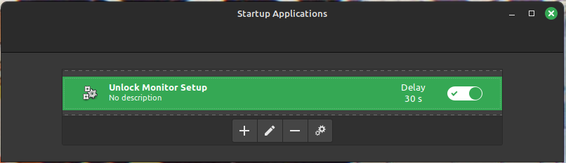

# Distro Hopping

1. Linux Mint
2. Fedora Gnome
3. Fedora KDE
4. Tuxedo OS
5. Nobara
6. OpenSUSE Tumbleweed
7. PopOS (if Cosmic is out)

Only in VMs
1. NixOS
2. Arch Linux

## Linux Mint

### Monitor Duplication
```bash
xrandr --output DP-0 --mode 3840x2160 --rate 60 --output DP-1 --same-as DP-0 --output HDMI-0 --same-as DP-0
```

https://github.com/linuxmint/cinnamon-screensaver/issues/210

```bash
#!/bin/bash

CAUGHT_SHUTDOWN="0"
trap handleShutdown SIGTERM

function handleShutdown()
{
    echo "caught shutdown SIGTERM signal"
    CAUGHT_SHUTDOWN="1"
    exit 0
}

dbus-monitor --session "type=signal,interface=org.cinnamon.ScreenSaver,member=ActiveChanged" | 
  while read MSG; do
    LOCK_STAT=`echo $MSG | awk '{print $NF}'`
    if [[ "$LOCK_STAT" == "member=ActiveChanged" ]]; then
        echo "was unlocked"
        xrandr --output DP-0 --mode 3840x2160 --rate 60 --output DP-1 --same-as DP-0 --output HDMI-0 --same-as DP-0
    fi

    if [ $CAUGHT_SHUTDOWN != "0" ]; then
        break
    fi
  done
```



### Gaming
Steam works fine on all games I've tried:
* Classic SW: Battlefront 1&2
* Celeste
* Tales of Symphonia

[8BitDo Controller issues](https://gist.github.com/ammuench/0dcf14faf4e3b000020992612a2711e2)

> 1. Create a new file /etc/udev/rules.d/99-8bitdo-xinput.rules
> 2. Paste this udev rule in there, then save and exit the file: 
>   
>   ```bash
>     ACTION=="add", ATTRS{idVendor}=="2dc8", ATTRS{idProduct}=="3106", RUN+="/sbin/modprobe xpad", RUN+="/bin/sh -c 'echo 2dc8 3106 > /sys/bus/usb/drivers/xpad/new_id'"
>   ```
> 3. Run the following command in a terminal: `sudo udevadm control --reload`
> 4. Unplug and replug the controller if it was already plugged in, it might take a second if you have the bluetooth version