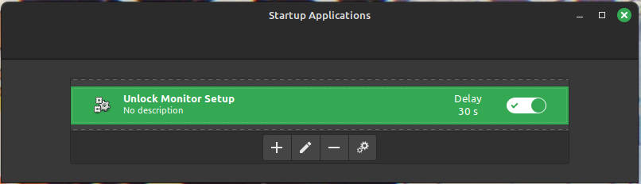

# Distro Hopping
My plan at the beginning of 2024 was to try some Linux distro hopping, because I hadn't tried any new distributions since I started using Linux Mint in college. I wanted to see what the Linux landscape had become in the time since then, and see if there were any desktop environments or distributions that met my needs better than Mint.

Unfortunately, I encountered multiple issues with this; from SSD failures, to Nvidia driver issues, to corrupted ISOs. While I did learn a bit, I ended up giving up, and just sticking with Mint because it's what worked. It wasn't perfect, but it was continuing to improve and I had a workaround for the biggest issue I encountered.

I'm going to build a new machine in 2025 and [try again](/tech/linux/distro-hopping-2025). Hopefully, some newer hardware better suited to Linux use will help prevent the issues I've been encountering.

## Linux Mint
Mint is my baseline. It's what I've bee using since the early 2010s and make day-to-day use of Linux simple and easy. It was also pretty easy to re-use some of the things I found when I [returned to Linux on the Framework](/tech/linux/framework) awhile back. I am happy to say, that the only things I need to use a terminal for (aside from [a situation where I am definitely an edge case](#monitor-duplication)) on my desktop are developer tools; which gives me a lot more confidence that, when I just want my system to work, it either will or the fix should be relatively simple.

The main issues I encountered with it were that it used an older Kernel (an issue that they fixed this year) and that [it only supports screen mirroring with exactly two displays](https://forums.linuxmint.com/viewtopic.php?t=418626).

### Monitor Duplication
To support my setup of three mirrored monitors, I had to put together a bit of a workaround. I was able to put together this command to force the monitors to mirror using `xrandr`.

```bash
xrandr --output DP-0 --mode 3840x2160 --rate 60 --output DP-1 --same-as DP-0 --output HDMI-0 --same-as DP-0
```

Unfortunately, that only works as a temporary solution, as I use KVM switches for a couple of the displays, and switching machines disconnects the display and causes Mint to reset the displays.

To counter that, I found an [example script](https://github.com/linuxmint/cinnamon-screensaver/issues/210) that was designed to run in the background and run a command every time the user locked or unlocked the desktop. All I had to do was change the command to the `xrandr` command I'd put together and set it to run at startup.

```bash
#!/bin/bash

CAUGHT_SHUTDOWN="0"
trap handleShutdown SIGTERM

function handleShutdown()
{
    echo "caught shutdown SIGTERM signal"
    CAUGHT_SHUTDOWN="1"
    exit 0
}

dbus-monitor --session "type=signal,interface=org.cinnamon.ScreenSaver,member=ActiveChanged" | 
  while read MSG; do
    LOCK_STAT=`echo $MSG | awk '{print $NF}'`
    if [[ "$LOCK_STAT" == "member=ActiveChanged" ]]; then
        echo "was unlocked"
        xrandr --output DP-0 --mode 3840x2160 --rate 60 --output DP-1 --same-as DP-0 --output HDMI-0 --same-as DP-0
    fi

    if [ $CAUGHT_SHUTDOWN != "0" ]; then
        break
    fi
  done
```

One thing I did find a bit frustrating during the process, was that when I searched for how to run the script at startup, I'd always end up with `init.d` solutions that ended up being way more complex than I wanted to deal with.  
Luckily, I was eventually able to find that Mint has a Startup Applications utility built in, and I was just able to use that to run the script.



### Gaming
The only real issues I've encountered with gaming have been issues with VR using the Meta Quest 3 (an issue I encountered on every distro I tried) and some issues with recognizing my 8BitDo controllers.

I did find a workaround for the 8BitDo controllers, but the problem has actually been fully solved now that Mint has moved towards a more up-to-date Kernel.

#### 8BitDo Workaround
[8BitDo Controller issues](https://gist.github.com/ammuench/0dcf14faf4e3b000020992612a2711e2)

> 1. Create a new file /etc/udev/rules.d/99-8bitdo-xinput.rules
> 2. Paste this udev rule in there, then save and exit the file: 
>   
>   ```bash
>     ACTION=="add", ATTRS{idVendor}=="2dc8", ATTRS{idProduct}=="3106", RUN+="/sbin/modprobe xpad", RUN+="/bin/sh -c 'echo 2dc8 3106 > /sys/bus/usb/drivers/xpad/new_id'"
>   ```
> 3. Run the following command in a terminal: `sudo udevadm control --reload`
> 4. Unplug and replug the controller if it was already plugged in, it might take a second if you have the bluetooth version

## Tuxedo OS
I did try Tuxedo OS, but I'm going to leave out my experiences with it, as I now believe many of the problems I encountered may have been a result of an SSD with SMART failures and/or signal integrity issues with the USB connection used to create the installation jump drive and install the OS. Frustrating, but not Tuxedo's fault.

<!-- ### Benefits
- Better Multimonitor Support
- Controller works ootb
  - This benefit is diminished by Mint Edge

### Issues
- Webcam issues
- Discover is a clear downgrade from Mint's Software Manager
- Trouble with apps respecting themes
  - https://github.com/prusa3d/PrusaSlicer/issues/10657
- MFA Apps don't always respect default browser -->

## Fedora
The last disto I ended up giving a real solid try was Fedora Workstation. Overall, I think the biggest thing I learned from it, is that I generally like Gnome as a desktop, but that I really wish they would be a bit less opinionated or be more pro-active in supporting their extensions (have a pre-installed extension store, don't break extensions, etc.). Not the most original opinion, but I at least have the experience to support it now.

### Extensions
Not too much to say here, just documenting the extensions I tried. I think, when I try this again in 2025, the only one I won't try again is Freon, and instead look for a different utility for hardware monitoring.

* [Add to Desktop](https://extensions.gnome.org/extension/3240/add-to-desktop/)
  * Technically wasn't supported on the version of Gnome I was on, but it worked fine.
* [AppIndicator and KStatusNotifierItem Support](https://extensions.gnome.org/extension/615/appindicator-support/)
* [Dash to Dock](https://extensions.gnome.org/extension/307/dash-to-dock/)
* [Desktop Icons NG (DING)](https://extensions.gnome.org/extension/2087/desktop-icons-ng-ding/)
* [Freon](https://extensions.gnome.org/extension/841/freon/)
* [Tiling Assistant](https://extensions.gnome.org/extension/3733/tiling-assistant/)
* [Wallpaper Slideshow](https://extensions.gnome.org/extension/6281/wallpaper-slideshow/)

### Developer Tools
Because of the nature of some developer tools being a bit lower level, there were a couple minor differences from what I'm used to in Mint. Nothing difficult, but I did need to do some setup.

#### Git Credentials in libsecret
I found a [fairly straightforward guide](https://discussion.fedoraproject.org/t/attention-git-credential-libsecret-for-storing-git-passwords-in-the-gnome-keyring-is-now-an-extra-package/18275) for setting up a Git credential manager, that basically abbreviated the setup to two simple commands:

```bash
sudo dnf install git-credential-libsecret

git config --global credential.helper libsecret
```

#### Installing ZSH
Similarly, ZSH was a [pretty simple setup](https://fedoramagazine.org/set-zsh-fedora-system/) in only two commands:

```bash
sudo dnf install zsh

chsh -s $(which zsh)
```

### Login Loop
The thing that killed my run with Fedora was that I ran into some kind of login loop, where I would put in my password, the screen would go black, and then I'd end up on the login screen again. At that point, I didn't really feel like fighting it, and moved onto PopOS (which I had some display issues with and returned to Mint, so I'm not even going to give it a section right now).

I have since realized that this may have also been caused by signal integrity issues with the USB connection used to create the installation jump drive and install the OS. I will be giving Fedora another shot in my [2025 attempt at distro hopping](/tech/linux/distro-hopping-2025.md).
~~Most of the info I saw suggested it's either a Wayland issue or a Desktop issue. If it's a Wayland issue, then I'd rather find a more stable base rather than the experimental base Fedora uses. If it's a Desktop issue, it's probably because of extensions and I'd rather not deal with a system that doesn't let me customize it like that.~~